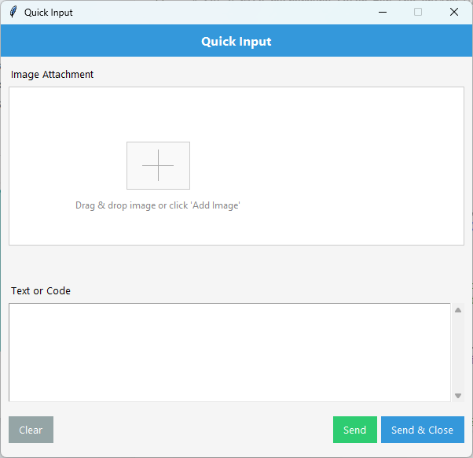

# MagicInput

Minimalistic, cross-platform popup GUI for quickly jotting down text/code **and** attaching screenshots or image files &mdash; perfect for bug reports, note-taking, QA, or sending prompts to AI tools.



## ✨ Features

* **One-shot input** window &mdash; automatically closes after you "Send"
* Drag-and-drop images (optional `tkinterdnd2`)
* Paste image from clipboard (⌘/Ctrl + V)
* Light / Dark theme toggle
* System-tray integration on Windows (via `pystray`)
* Saves all attachments & prompt history to a hidden `.MagicInput/` folder next to the script
* Auto-installs missing Python dependencies on first run

## 🚀 Quick Start

```bash
# clone
git clone https://github.com/cursor-windsarf/MagicInput.git
cd MagicInput

# run with any modern Python (3.8+)
python MagicInput.py
```

The first launch may take a moment while required packages (Pillow, pystray, etc.) are installed automatically.

## 🖥️ Requirements

* Python **3.8+** with `pip`
* On Windows, the optional tray icon uses **pywin32** (auto-installed)
* For drag-and-drop support, install [`tkinterdnd2`](https://pypi.org/project/tkinterdnd2/) (optional)

## 📸 Screenshots

| | |
|---|---|
|  |  |
|  |  |

## 🤖 Usage tips

1. Type or paste any text / code into the editor pane.
2. Drag images onto the canvas **or** hit the camera button to choose files.
3. Press **Send** (or <kbd>Ctrl</kbd> + <kbd>Enter</kbd>) to save the prompt + images.
4. Find your content inside `.MagicInput/` for easy uploading or automation.

## 🛠️ Contributing

Issues and pull requests are welcome!  Feel free to open tickets for bugs, feature ideas or UI polish.

Ensure `pre-commit` passes before submitting a PR:

```bash
pip install pre-commit
pre-commit run --all-files
```

## 📜 License

This project is released under the **MIT License** &mdash; see [`LICENSE`](LICENSE) for details. 